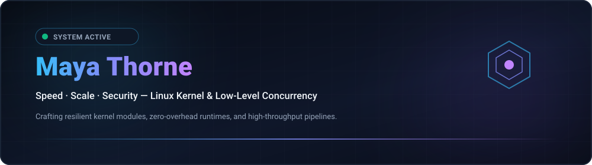

  
  

  <strong>Architecting Resilient Low-Level Systems, Kernel Modules &amp; High-Throughput Concurrency Primitives.</strong> 
  Speed · Scale · Security — Engineering with clarity and conviction.

  <strong>🇺🇸 English</strong> · <a href="./locales/ko.md">🇰🇷 한국어</a> · <a href="./locales/zh-CN.md">🇨🇳 中文</a> · <a href="./locales/es.md">🇪🇸 Español</a> · <a href="./locales/hi.md">🇮🇳 हिन्दी</a> 
  <a href="./locales/ar.md">🇸🇦 العربية</a> · <a href="./locales/pt-BR.md">🇧🇷 Português</a> · <a href="./locales/ru.md">🇷🇺 Русский</a> · <a href="./locales/fr.md">🇫🇷 Français</a> · <a href="./locales/id.md">🇮🇩 Bahasa Indonesia</a>

  
  
  
  

---

<h2 style="display:inline-block; margin:0;">💡 About & Engineering Ethos</h2>

 

Architecting resilient low-level software systems, Linux kernel modules, and high-throughput concurrency primitives. Engineering centered around mechanical sympathy and zero-overhead performance:

- **⚡ Zero-Cost & Mechanical Sympathy — Code that respects CPU cache hierarchies, memory alignment, and branch predictors. Zero-overhead abstractions by default.**
- **🐧 Kernel-First Thinking — Treating the operating system kernel not as an opaque black box, but as the foundational runtime. Deep mastery of io_uring, eBPF, and lockless queues.**
- **🔒 Invariant-Driven Correctness — Enforcing safety at compile-time wherever possible. Strict state machine transitions, lock-free ring buffers, and continuous fuzzing suites.**

  <em>"In the terminal we trust. Make it deterministic. Automate the friction away."</em>

---

<h2 style="display:inline-block; margin:0;">🚀 Projects & Solutions</h2>

 

Low-level system libraries, kernel modules, and concurrent communication primitives designed for ultra-low latency and maximum mechanical sympathy:

<table>
  <tr>
    <td width="50%" valign="top">
      <h4>🐧 <a href="https://github.com/maya-thorne?tab=repositories">nexus-kernel-core</a></h4>
      
<em>High-performance Linux kernel module implementing zero-copy memory ring buffers and lock-free IPC primitives.</em>

      <ul>
        <li><strong>⚡ io_uring / eBPF</strong>: High-throughput submission/completion rings</li>
        <li><strong>🔒 Memory Safe</strong>: Invariant-enforced concurrency boundaries</li>
      </ul>
    </td>
    <td width="50%" valign="top">
      <h4>⚡ <a href="https://github.com/maya-thorne?tab=repositories">uring-reactor</a></h4>
      
<em>Asynchronous I/O event loop built on modern Linux io_uring with sub-microsecond latency and zero syscall overhead.</em>

      <ul>
        <li><strong>⏱️ Sub-Microsecond</strong>: Zero syscall overhead event dispatching</li>
        <li><strong>🛡️ Lockless SPMC</strong>: Cache-aligned atomic ring sequencing</li>
      </ul>
    </td>
  </tr>
</table>

  <a href="https://github.com/maya-thorne?tab=repositories">🔗 Browse Public Repositories</a> ·
  <a href="https://github.com/maya-thorne">📖 Explore Systems Architecture</a>

---

<h2 style="display:inline-block; margin:0;">🚀 Featured Capabilities & Architectures</h2>

 

<table>
  <tr>
    <td width="50%" valign="top">
      <h4>⚙️ Kernel & Low-Level Primitives</h4>
      
<em>Asynchronous I/O via io_uring, kernel-bypass networking, and real-time observability.</em>

      <ul>
        <li><strong>⚡ io_uring &amp; Async I/O</strong>: High-throughput submission/completion queues bypassing legacy epoll overhead.</li>
        <li><strong>🛡️ Kernel Bypass &amp; XDP</strong>: eBPF/XDP programmable fast-path packet filtering and DPDK acceleration.</li>
        <li><strong>🔄 Lock-Free Primitives</strong>: SPMC/MPSC atomic queues, hazard pointers, and memory barrier sequencing.</li>
      </ul>
    </td>
    <td width="50%" valign="top">
      <h4>🌐 Distributed Systems & Concurrency</h4>
      
<em>Modern CSP-style concurrency pipelines and memory-safe systems software.</em>

      <ul>
        <li><strong>⚙️ Systems Tooling</strong>: Idiomatic modern C23, async/unsafe Rust (no_std), and Zig toolchains.</li>
        <li><strong>📦 Zero-Copy Data Flow</strong>: Cache-aligned memory serialization over NVMe storage and 100GbE fabrics.</li>
        <li><strong>🎯 Invariant Validation</strong>: Finite-state automaton verification and automated fuzzing suites.</li>
      </ul>
    </td>
  </tr>
</table>

---

<h2 style="display:inline-block; margin:0;">⚡ Technology Stack & Tooling</h2>

 

<em>Engineering toolchain for high-performance systems and bare-metal runtime execution:</em>

<table>
  <tr>
    <td width="50%" valign="top">
      <h4>⚙️ Low-Level & Systems</h4>
      <ul>
        <li><strong>Languages: C23, Rust (Async/Unsafe/No_std), Zig, x86_64 / ARM64 Assembly</strong></li>
        <li><strong>Kernel Runtimes: Linux Kernel Modules, POSIX APIs, eBPF / XDP, io_uring</strong></li>
        <li><strong>Memory & Concurrency: Lock-free atomics, SIMD vectorization, NUMA-aware allocators</strong></li>
      </ul>
    </td>
    <td width="50%" valign="top">
      <h4>🌐 Distributed & Infrastructure</h4>
      <ul>
        <li><strong>Networking: Kernel-bypass (DPDK), epoll/kqueue, WebSockets, gRPC</strong></li>
        <li><strong>Observability: bpftrace, perf, Valgrind, GDB, Prometheus telemetry</strong></li>
        <li><strong>Environment: Arch Linux, Debian, Docker, LLVM/Clang toolchains, Neovim / Tmux</strong></li>
      </ul>
    </td>
  </tr>
</table>

 

  

---

<h2 style="display:inline-block; margin:0;">🗺️ Explore Projects & Roadmaps</h2>

 

<em>Active roadmap and technical initiatives across low-level infrastructure:</em>

<ul>
  <li>🎯 Current Focus: io_uring multi-ring polling benchmarks & kernel module fuzzing harness</li>
  <li>🚀 Next Milestone: Lock-free SPMC work-stealing scheduler with NUMA cache-pinning</li>
  <li>🔮 Future Research: eBPF-driven network flow router with hardware offloading</li>
</ul>

---

<h2 style="display:inline-block; margin:0;">📊 Architecture Dashboard & Delivery Metrics</h2>

 

  

    
    
  

---

## 📬 Connect & Collaborate

Interested in discussing low-level systems architectures, Linux kernel internals, or high-performance concurrency primitives?

[GitHub Profile](https://github.com/maya-thorne) · [Public Repositories](https://github.com/maya-thorne?tab=repositories) · [Discussions](https://github.com/maya-thorne?tab=discussions) · [Send an Email](mailto:zse4123jo@gmail.com)

   
  © 2026 Maya Thorne · Built with mechanical sympathy · 🐧

