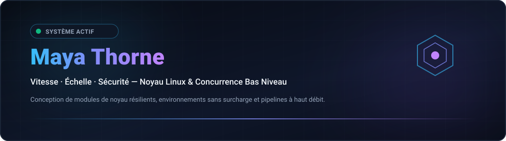

  
  

  <strong>Architecting Resilient Low-Level Systems, Kernel Modules &amp; High-Throughput Concurrency Primitives.</strong> 
  Speed · Scale · Security — Engineering with clarity and conviction.

  <a href="../README.md">🇺🇸 English</a> · <a href="./ko.md">🇰🇷 한국어</a> · <a href="./zh-CN.md">🇨🇳 中文</a> · <a href="./es.md">🇪🇸 Español</a> · <a href="./hi.md">🇮🇳 हिन्दी</a> 
  <a href="./ar.md">🇸🇦 العربية</a> · <a href="./pt-BR.md">🇧🇷 Português</a> · <a href="./ru.md">🇷🇺 Русский</a> · <strong>🇫🇷 Français</strong> · <a href="./id.md">🇮🇩 Bahasa Indonesia</a>

  
  
  
  

---

<h2 style="display:inline-block; margin:0;">💡 Philosophie d'Ingénierie & Principes</h2>

 

Conception de systèmes logiciels bas niveau résilients, de modules du noyau Linux et de primitives de concurrence à haut débit :

- **⚡ Coût Zéro & Sympathie Mécanique — Code respectueux des hiérarchies de cache CPU et de l'alignement mémoire.**
- **🐧 Pensée Centrée sur le Noyau — Le noyau Linux comme runtime fondamental : io_uring, eBPF et files d'attente sans verrou.**
- **🔒 Correction par Invariants — Sécurité imposée à la compilation avec transitions strictes de machines d'états.**

  <em>"Dans le terminal nous avons confiance. Rendez-le déterministe. Automatisez la friction."</em>

---

<h2 style="display:inline-block; margin:0;">🚀 Projets & Solutions</h2>

 

Les projets publics sont faciles à parcourir; les travaux privés restent intentionnellement masqués par cryptographie.

### Systèmes et Solutions Phares

<table>
  <tr>
    <td width="50%" valign="top">
      

        
      

      <h4>🗺️ <a href="https://github.com/maya-thorne/github-org-map">github-org-map</a></h4>
      
<em>Cartographie et topologie quotidiennes automatisées des dépôts maya-thorne avec masquage SHA-256 à divulgation nulle de connaissance.</em>

      

        
        
        
      

      <ul>
        <li><strong>🔄 Automation</strong>: Workflow GitHub Actions quotidien sans aucune fuite de jetons</li>
        <li><strong>🛡️ Privacy</strong>: Masque les dépôts privés tout en visualisant l'architecture globale</li>
        <li><strong>🎨 Visualization</strong>: Génération dynamique de diagrammes vectoriels SVG et de GIF chronologiques</li>
      </ul>
    </td>
    <td width="50%" valign="top">
      

        
      

      <h4>🔒 <a href="https://github.com/maya-thorne/github-org-map-private">github-org-map-private</a></h4>
      
<em>Dépôt compagnon privé et moteur de télémétrie pour le développement interne et l'audit continu.</em>

      

        
        
        
      

      <ul>
        <li><strong>🔐 Dual Pipeline</strong>: Double pipeline: génère des vues internes non masquées et des artefacts publics sécurisés</li>
        <li><strong>⚡ Zero-SPOF Topology</strong>: Topologie Zero-SPOF: rotation des identifiants et résilience aux pannes</li>
        <li><strong>🏛️ Confidentiality</strong>: Confidentialité: secrets encapsulés avec garantie stricte de zéro fuite</li>
      </ul>
    </td>
  </tr>
</table>

  <a href="https://github.com/maya-thorne?tab=repositories">🔗 Parcourir les dépôts publics</a> ·
  <a href="https://github.com/maya-thorne/github-org-map">🗺️ Explorer la carte de l'organisation</a>

---

<h2 style="display:inline-block; margin:0;">🚀 Capacités & Architectures en Vedette</h2>

 

<table>
  <tr>
    <td width="50%" valign="top">
      <h4>⚙️ Noyau et Primitives Bas Niveau</h4>
      
<em>E/S asynchrones via io_uring, contournement du noyau en réseau et observabilité en temps réel.</em>

      <ul>
        <li><strong>⚡ io_uring &amp; E/S Asynchrones</strong>: Anneaux de haute performance contournant le coût de l'epoll hérité.</li>
        <li><strong>🛡️ Kernel Bypass &amp; XDP</strong>: Filtrage rapide de paquets avec eBPF/XDP et accélération DPDK.</li>
        <li><strong>🔄 Primitives Sans Verrou</strong>: Files atomiques SPMC/MPSC et ordonnancement strict des barrières mémoire.</li>
      </ul>
    </td>
    <td width="50%" valign="top">
      <h4>🌐 Systèmes Distribués et Concurrence</h4>
      
<em>Pipelines concurrents style CSP et logiciels système à mémoire sécurisée.</em>

      <ul>
        <li><strong>⚙️ Outillage Systèmes</strong>: C23 moderne, Rust asynchrone/unsafe (no_std) et Zig.</li>
        <li><strong>📦 Flux Zéro-Copie</strong>: Sérialisation alignée sur le cache sur stockage NVMe et 100GbE.</li>
        <li><strong>🎯 Validation d'Invariants</strong>: Automates finis vérifiés et suites de fuzzing continu.</li>
      </ul>
    </td>
  </tr>
</table>

---

<h2 style="display:inline-block; margin:0;">⚡ Pile Technologique & Outillage</h2>

 

<em>Boîte à outils d'ingénierie pour systèmes haute performance :</em>

<table>
  <tr>
    <td width="50%" valign="top">
      <h4>⚙️ Bas Niveau et Systèmes</h4>
      <ul>
        <li><strong>Langages : C23, Rust (Async/Unsafe/No_std), Zig, Assembleur x86_64 / ARM64</strong></li>
        <li><strong>Environnements Noyau : Modules Linux, APIs POSIX, eBPF / XDP, io_uring</strong></li>
        <li><strong>Mémoire & Concurrence : Atomiques lock-free, vectorisation SIMD, allocateurs NUMA</strong></li>
      </ul>
    </td>
    <td width="50%" valign="top">
      <h4>🌐 Distribué & Infrastructure</h4>
      <ul>
        <li><strong>Réseau : Contournement du noyau (DPDK), epoll/kqueue, WebSockets, gRPC</strong></li>
        <li><strong>Observabilité : bpftrace, perf, Valgrind, GDB, télémétrie Prometheus</strong></li>
        <li><strong>Environnement : Arch Linux, Debian, Docker, LLVM/Clang, Neovim / Tmux</strong></li>
      </ul>
    </td>
  </tr>
</table>

 

  

---

<h2 style="display:inline-block; margin:0;">🗺️ Explorer les Projets & Feuille de Route</h2>

 

<strong>Carte de l'Organisation et Topologie</strong>

  

  Les dépôts privés apparaissent uniquement sous forme d'étiquettes masquées. 
  <a href="https://github.com/maya-thorne/github-org-map">Explorer la topologie et la cartographie →</a>

 

<em>Active roadmap and technical initiatives across low-level infrastructure:</em>

<ul>
  <li>🎯 Current Focus: io_uring multi-ring polling benchmarks & kernel module fuzzing harness</li>
  <li>🚀 Next Milestone: Lock-free SPMC work-stealing scheduler with NUMA cache-pinning</li>
  <li>🔮 Future Research: eBPF-driven network flow router with hardware offloading</li>
</ul>

---

<h2 style="display:inline-block; margin:0;">📊 Tableau de Bord d'Architecture & Métriques</h2>

 

  

    
    
  

---

## 📬 Connexion & Collaboration

Intéressé par les architectures de systèmes bas niveau, le noyau Linux ou la concurrence haute performance ?

[Profil GitHub](https://github.com/maya-thorne) · [Dépôts Publics](https://github.com/maya-thorne?tab=repositories) · [Discussions](https://github.com/maya-thorne?tab=discussions) · [Envoyer un E-mail](mailto:zse4123jo@gmail.com)

   
  © 2026 Maya Thorne · Bâti avec sympathie mécanique · 🐧

