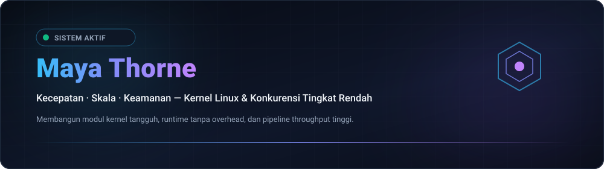

  
  

  <strong>Architecting Resilient Low-Level Systems, Kernel Modules &amp; High-Throughput Concurrency Primitives.</strong> 
  Speed · Scale · Security — Engineering with clarity and conviction.

  <a href="../README.md">🇺🇸 English</a> · <a href="./ko.md">🇰🇷 한국어</a> · <a href="./zh-CN.md">🇨🇳 中文</a> · <a href="./es.md">🇪🇸 Español</a> · <a href="./hi.md">🇮🇳 हिन्दी</a> 
  <a href="./ar.md">🇸🇦 العربية</a> · <a href="./pt-BR.md">🇧🇷 Português</a> · <a href="./ru.md">🇷🇺 Русский</a> · <a href="./fr.md">🇫🇷 Français</a> · <strong>🇮🇩 Bahasa Indonesia</strong>

  
  
  
  

---

<h2 style="display:inline-block; margin:0;">💡 Filosofi Rekayasa & Prinsip</h2>

 

Merancang sistem perangkat lunak tingkat rendah yang tangguh, modul kernel Linux, dan primitif konkurensi throughput tinggi:

- **⚡ Biaya Nol & Simpati Mekanis — Kode yang menghormati hierarki cache CPU dan perataan memori.**
- **🐧 Pemikiran Berbasis Kernel — Kernel Linux sebagai runtime fundamental: io_uring, eBPF, dan antrean lock-free.**
- **🔒 Kebenaran Berbasis Invarian — Keamanan ditegakkan pada waktu kompilasi dengan transisi mesin status yang ketat.**

  <em>"Pada terminal kami percaya. Jadikan deterministik. Otomatiskan gesekan."</em>

---

<h2 style="display:inline-block; margin:0;">🚀 Proyek & Solusi</h2>

 

Pustaka sistem tingkat rendah dan modul kernel yang dirancang untuk latensi ultra-rendah:

<table>
  <tr>
    <td width="50%" valign="top">
      <h4>🐧 <a href="https://github.com/maya-thorne?tab=repositories">nexus-kernel-core</a></h4>
      
<em>Modul kernel Linux berkinerja tinggi yang mengimplementasikan buffer cincin memori zero-copy dan IPC lock-free.</em>

      <ul>
        <li><strong>⚡ io_uring / eBPF</strong>: High-throughput submission/completion rings</li>
        <li><strong>🔒 Memory Safe</strong>: Invariant-enforced concurrency boundaries</li>
      </ul>
    </td>
    <td width="50%" valign="top">
      <h4>⚡ <a href="https://github.com/maya-thorne?tab=repositories">uring-reactor</a></h4>
      
<em>Loop peristiwa I/O asinkron yang dibangun di atas io_uring dengan latensi sub-mikrodetik tanpa syscall overhead.</em>

      <ul>
        <li><strong>⏱️ Sub-Microsecond</strong>: Zero syscall overhead event dispatching</li>
        <li><strong>🛡️ Lockless SPMC</strong>: Cache-aligned atomic ring sequencing</li>
      </ul>
    </td>
  </tr>
</table>

  <a href="https://github.com/maya-thorne?tab=repositories">🔗 Jelajahi Repositori Publik</a> ·
  <a href="https://github.com/maya-thorne">📖 Lihat Spesifikasi Arsitektur</a>

---

<h2 style="display:inline-block; margin:0;">🚀 Kemampuan & Arsitektur Unggulan</h2>

 

<table>
  <tr>
    <td width="50%" valign="top">
      <h4>⚙️ Kernel dan Primitif Tingkat Rendah</h4>
      
<em>I/O asinkron via io_uring, jaringan kernel-bypass, dan observabilitas real-time.</em>

      <ul>
        <li><strong>⚡ io_uring &amp; Asinkron I/O</strong>: Buffer cincin throughput tinggi melewati overhead epoll warisan.</li>
        <li><strong>🛡️ Kernel Bypass &amp; XDP</strong>: Pemfilteran paket cepat eBPF/XDP dan akselerasi DPDK.</li>
        <li><strong>🔄 Primitif Lock-Free</strong>: Antrean atomik SPMC/MPSC dan pengurutan barrier memori yang ketat.</li>
      </ul>
    </td>
    <td width="50%" valign="top">
      <h4>🌐 Sistem Terdistribusi dan Konkurensi</h4>
      
<em>Pipeline konkurensi gaya CSP dan perangkat lunak sistem aman memori.</em>

      <ul>
        <li><strong>⚙️ Perangkat Sistem</strong>: C23 modern, Rust asinkron/unsafe (no_std), dan toolchain Zig.</li>
        <li><strong>📦 Aliran Data Zero-Copy</strong>: Serialisasi memori sejajar cache di atas penyimpanan NVMe dan 100GbE.</li>
        <li><strong>🎯 Validasi Invarian</strong>: Verifikasi automata hingga dan rangkaian fuzzing otomatis.</li>
      </ul>
    </td>
  </tr>
</table>

---

<h2 style="display:inline-block; margin:0;">⚡ Tumpukan Teknologi & Perangkat</h2>

 

<em>Rangkaian alat rekayasa untuk sistem berkinerja tinggi dan eksekusi bare-metal:</em>

<table>
  <tr>
    <td width="50%" valign="top">
      <h4>⚙️ Tingkat Rendah dan Sistem</h4>
      <ul>
        <li><strong>Bahasa: C23, Rust (Async/Unsafe/No_std), Zig, Assembly x86_64 / ARM64</strong></li>
        <li><strong>Runtime Kernel: Linux Kernel Modules, POSIX APIs, eBPF / XDP, io_uring</strong></li>
        <li><strong>Memori & Konkurensi: Atomik lock-free, vektorisasi SIMD, alokator NUMA</strong></li>
      </ul>
    </td>
    <td width="50%" valign="top">
      <h4>🌐 Terdistribusi & Infrastruktur</h4>
      <ul>
        <li><strong>Jaringan: Kernel-bypass (DPDK), epoll/kqueue, WebSockets, gRPC</strong></li>
        <li><strong>Observabilitas: bpftrace, perf, Valgrind, GDB, telemetri Prometheus</strong></li>
        <li><strong>Lingkungan: Arch Linux, Debian, Docker, LLVM/Clang, Neovim / Tmux</strong></li>
      </ul>
    </td>
  </tr>
</table>

 

  

---

<h2 style="display:inline-block; margin:0;">🗺️ Jelajahi Proyek & Peta Jalan</h2>

 

<em>Peta jalan aktif dan inisiatif teknis pada infrastruktur tingkat rendah:</em>

<ul>
  <li>🎯 Fokus Saat Ini: Tolok ukur polling multi-ring io_uring dan fuzzing modul kernel</li>
  <li>🚀 Tonggak Berikutnya: Penjadwal pencurian tugas SPMC lock-free dengan NUMA pinning</li>
  <li>🔮 Riset Masa Depan: Router aliran jaringan berbasis eBPF dengan offloading perangkat keras</li>
</ul>

---

<h2 style="display:inline-block; margin:0;">📊 Dasbor Arsitektur & Metrik</h2>

 

  

    
    
  

---

## 📬 Terhubung & Berkolaborasi

Tertarik mendiskusikan arsitektur sistem tingkat rendah, kernel Linux, atau primitif konkurensi?

[Profil GitHub](https://github.com/maya-thorne) · [Repositori Publik](https://github.com/maya-thorne?tab=repositories) · [Diskusi](https://github.com/maya-thorne?tab=discussions) · [Kirim Email](mailto:zse4123jo@gmail.com)

   
  © 2026 Maya Thorne · Dibangun dengan simpati mekanis · 🐧

